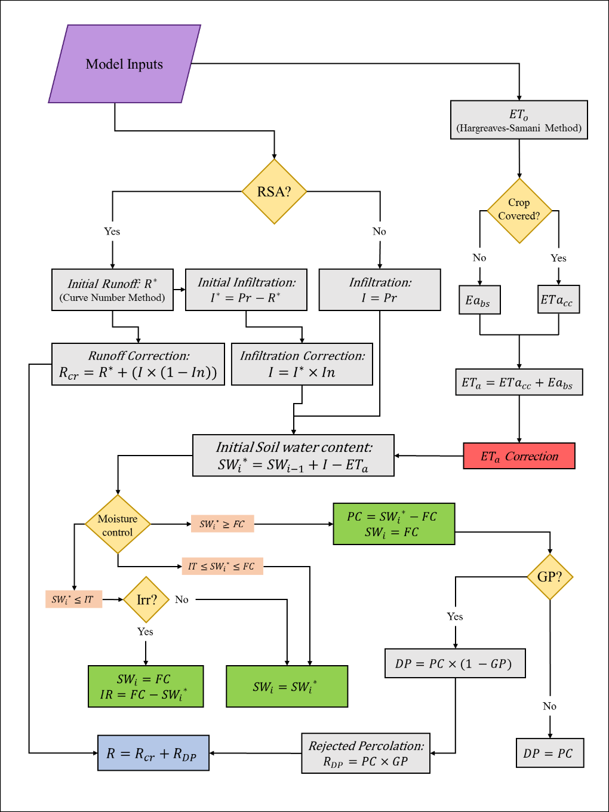
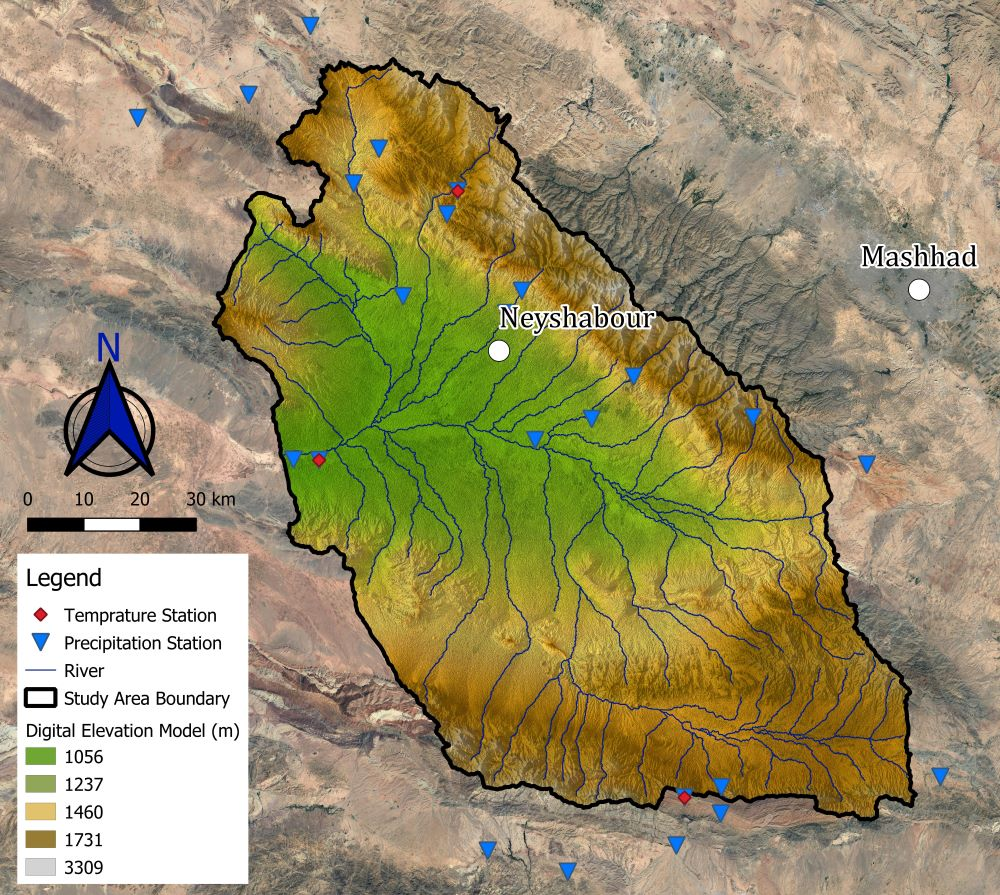
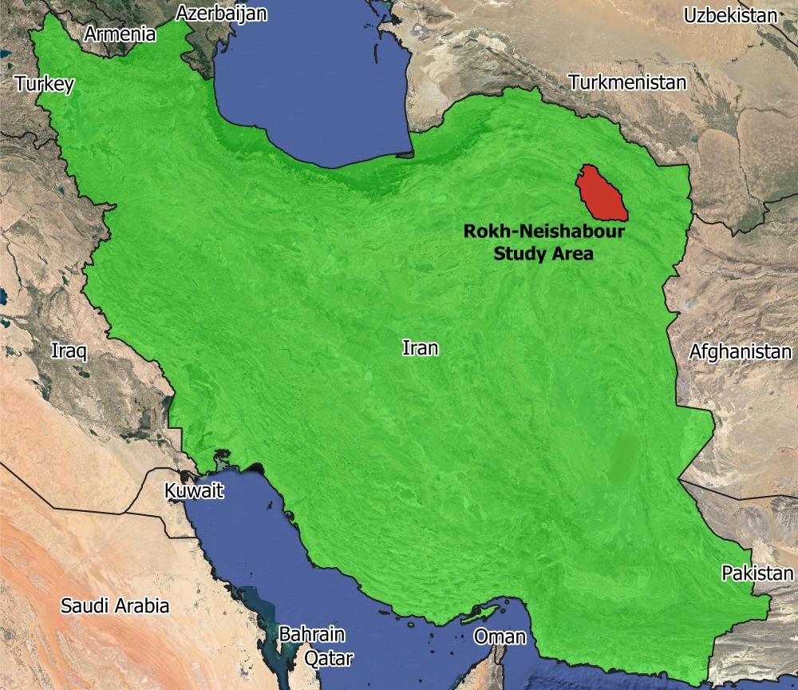

# QDWB_Version_1.0
This code was developed under my master thesis project titled "***Development of a Quasi-Distributed Water Balance Model for Arid and Semi-Arid Regions***" to estimate the water balance model in a catchment scale. Inputs are prepared in ASCII format and represent the Rokh-Neishabour study area in Iran.

## Thesis Abstract
Water resources management in different regions has different approaches. Yet, some aspects should be considered in most of these approaches such as water balance equations which provide wide-angle perspectives for **decision-making**. Based on the **availability of data** in an area, *Water balance equations* can be solved through various procedures. The use of computer modeling for hydrological processes is one of these procedures that has been widely approached in the previous decades. While classic methods may be inaccurate, they also waste time to outcome with a final result. Thus, due to the low rate of renewability for water resources in arid and semi-arid regions, the importance of water balance modeling becomes more obvious as simultaneously authorities need to make decisions more precisely. Generally, models might expect many details as requirements that make them unavailable for many regions. In other words, they could generate non-accurate results when inputs are either imperfect or have missing data. In this study, a process-based quasi-distributed water balance model (QDWB) was developed with a daily time step concept which is implicated for basin scale studies with inadequate data records. The model has been deployed for the semi-arid Rokh-Neishabour watershed and the results are presented for a 12-year time period. Annual outputs show reasonable results and have revealed suitable correlations (R2=0.95) with other models’ outputs as well. Despite QDWB being experimental, further developments are expected to be implemented.

## QDWB Model Flowchart

## Rokh-Neishabour study area

## Location of study area in IRAN

